# Spotter Documentation

## Changing Default Settings

### Change the Default Units

| Step | Screenshot |
| --- | --- |
| 1. Navigate to Spotter Server Settings.   2. Go to the **Settings** tab.   3. Set **Speed** to **Meters per Second** and **Distance** to **Meters**. | 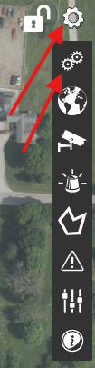    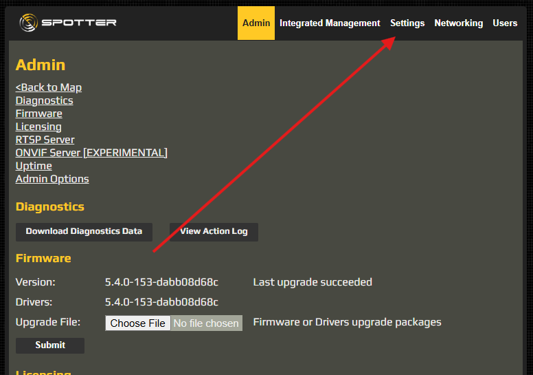    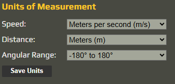 |

## Creating Filters

| Description | Screenshots |
| --- | --- |
| Create filters by going to **Filter** and clicking the **+** button. | 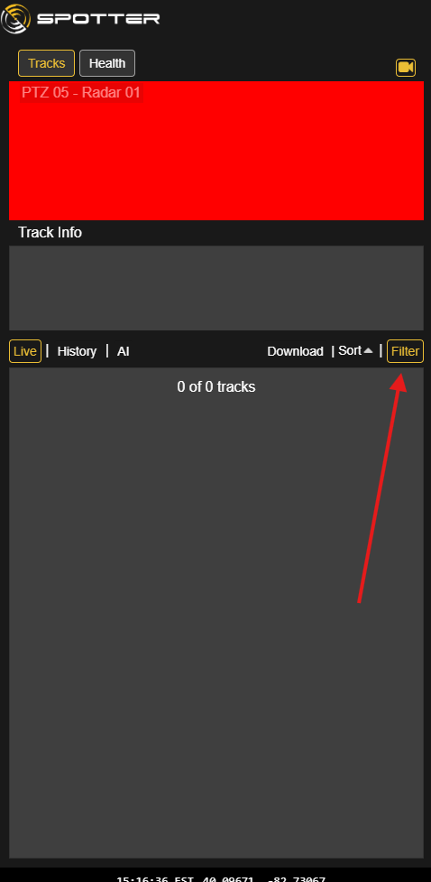    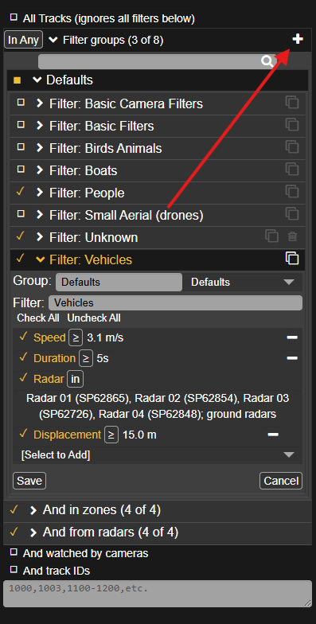 |

### People Filter

| Instructions | Screenshot |
| --- | --- |
| Filter: **People** is a default, so you just need to modify the default *People* filter.   • Remove the upper bounds of speed.  • Change duration to **5 seconds**.  • Select appropriate radars (usually can set to **all ground radars**).  • Replace distance with **Displacement ≥ 10 m**. | 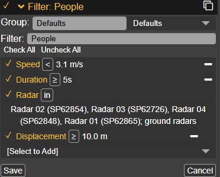 |

### Unknown Filter

| Instructions | Screenshot |
| --- | --- |
| Filter: **Unknown** is not a default and needs to be created manually.   • Set **Type = Unknown** with **0% confidence**.  • Select appropriate radars (usually can set to **all ground radars**). | 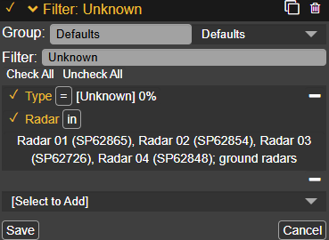 |

### Vehicle Filter

| Instructions | Screenshot |
| --- | --- |
| Filter: **Vehicles** is a default, so you just need to modify the default *Vehicles* filter.   • Remove the lower bounds of speed.  • Change duration to **5 seconds**.  • Select appropriate radars (usually can set to **all ground radars**).  • Replace distance with **Displacement ≥ 15 m**. | 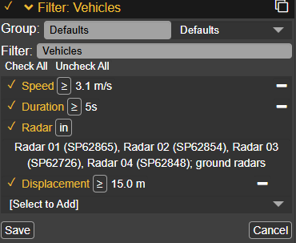 |

## Creating Classifications

| Instructions | Screenshots |
| --- | --- |
| Classifications are a type of **Action**.   1. Go to **Actions**.  2. Create a new action by clicking the **+** icon.  3. Set the **Type** to **Classification**. | 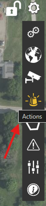    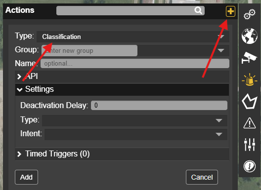 |

### Probable People Classification

| Instructions | Screenshot |
| --- | --- |
| • Set the name to **“Probable Person”**.  • Set the **Type** to **Person**.  • Set the **Intent** to **Unknown**. | 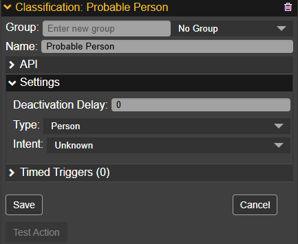 |

### Probable Vehicle Classification

| Instructions | Screenshot |
| --- | --- |
| • Set the name to **“Probable Vehicle”**.  • Set the **Type** to **Vehicle**.  • Set the **Intent** to **Unknown**. | 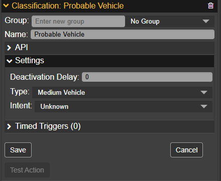 |

## Setting Radar Sensitivity

### Default Sensitivity

| Instructions | Screenshots |
| --- | --- |
| 1. Go to **Settings**.  2. Go to **Devices**.  3. Select the desired radar.  4. Go to **Sensitivity**.  5. Select the preset **“Medium Wind”**.     • In some firmware, it is just called **“Medium”**. | 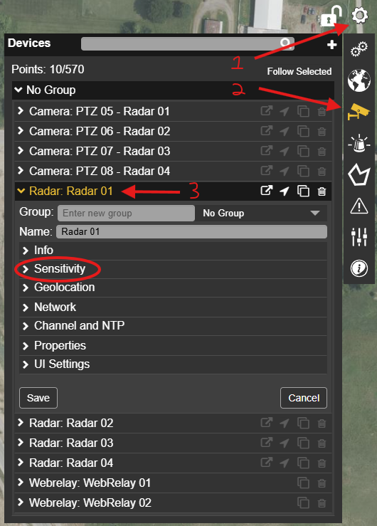    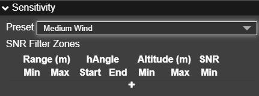 |

## Adding Zone Classifications

### Classification: Probable People

| Instructions | Screenshots |
| --- | --- |
| 1. Go to **Settings**.  2. Go to **Zones**.  3. Select the desired Zone.  4. Go to **Actions**.  5. Add a new action.  6. Configure the action:  &nbsp;&nbsp;• Set **Type** to **Classification**.  &nbsp;&nbsp;• Set **Action** to your **“Classification: Probable Person”** you created.  &nbsp;&nbsp;• Set **Filter Group** to **People**.  &nbsp;&nbsp;• Click **Add**. | 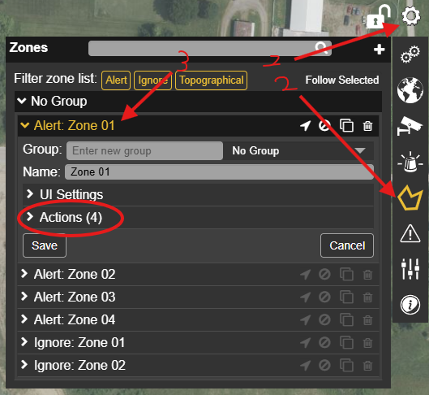        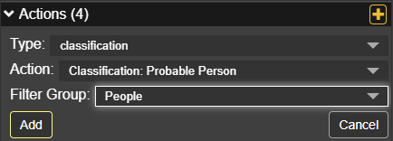 |

### Classification: Probable Vehicle

| Instructions | Screenshots |
| --- | --- |
| 1. Go to **Settings**.  2. Go to **Zones**.  3. Select the desired Zone.  4. Go to **Actions**.  5. Add a new action.  6. Configure the action:  &nbsp;&nbsp;• Set **Type** to **Classification**.  &nbsp;&nbsp;• Set **Action** to your **“Classification: Probable Vehicle”** you created.  &nbsp;&nbsp;• Set **Filter Group** to **Vehicles**.  &nbsp;&nbsp;• Click **Add**. |         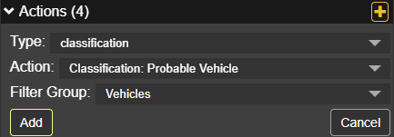 |